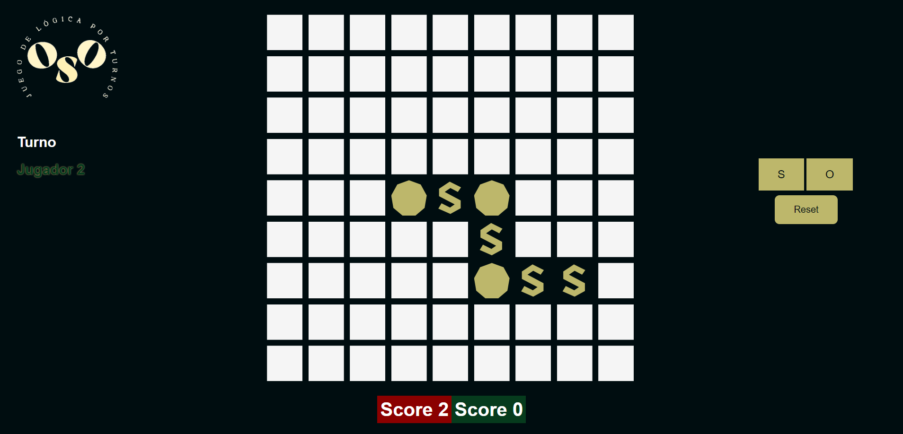

## <b>OSO - Juego de lógica</b>

## <b>¿En qué consiste el juego?</b>

Oso es un juego de lógica por turnos al estilo *"Tres en raya"* en el cual cada jugador debe colocar sobre el tablero una letra, "S" y "O" hasta completar la palabra <b>"OSO"</b>. El jugador que al final de la partida haya logrado completar la mayor cantidad de veces posible la palabra <b>"OSO"</b> será el ganador.
Como regla general solo cuentan las palabras formadas de manera verticual u horizontal.

## <b>¿Cómo esta desarrollado?</b>

El juego está construido completamente con React. Consta de 6 componentes y un archivo JS que contiene la lógica para ganar la partida. Hooks como <b>useState</b> y el uso de <b>props</b> son dos elementos ampliamente usados para desarrollar el juego.

## <b>Futuras mejoras</b>

El marcaje especial dentro del tablero de cada palabra <b>"OSO"</b> completada por algún jugador, resaltándola con el color de ese jugador, es una de las próximas mejoras a realizar. Otra posible actualización puede ser utilizar <b>useEffect </b>para permitir guardar partidas y ganadores en el <b>Local Storage</b>.